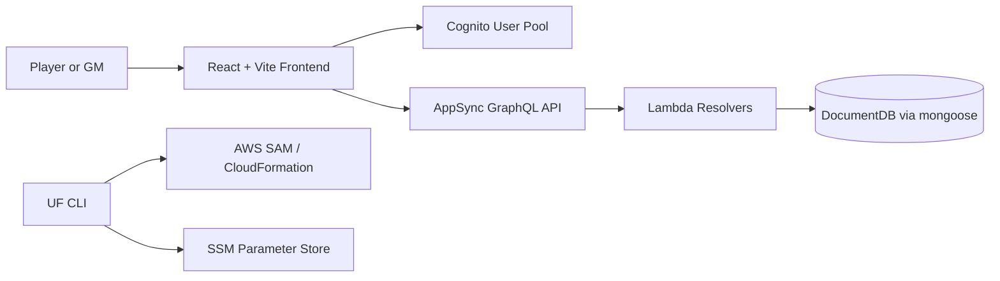

# Architecture

## Overview

Ultimate Fantasy TTRPG uses a React frontend, AppSync GraphQL API, Lambda resolvers, Cognito auth, and DocumentDB persistence.

## Frontend responsibilities

- Authenticate users with Amplify + Cognito.
- Render protected pages for characters, campaigns, skills, and admin tools.
- Enforce the 20-character client-side cap.
- Present fantasy-themed components via shared design tokens.

## Backend responsibilities

- Authorize users from AppSync identity metadata.
- Enforce ownership and admin rules.
- Persist characters, campaigns, and skills in DocumentDB.
- Expose focused GraphQL query and mutation handlers.
